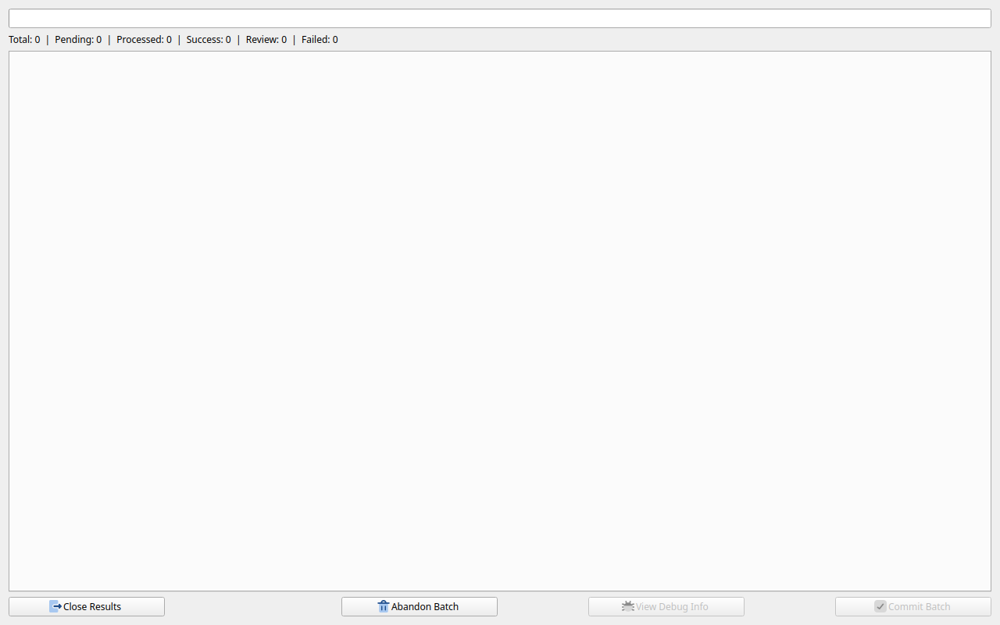

[](LICENSE)
[](https://github.com/boscorat/openstan/releases)
[](https://github.com/boscorat/openstan/actions/workflows/release.yml)
[](https://openstan.org)

# openstan — Free UK Bank Statement Analyser

**Parse, analyse, and export your UK bank statement PDFs in seconds. Free, open source, and 100% offline — your data never leaves your machine.**

> "I built openstan because I was manually typing HSBC statements into spreadsheets for my tax return. There had to be a better way." — Jason Farrar, creator

Import an entire year of statements, build reports, and export to Excel in under a minute. No subscription. No account. No internet connection required.



> Full documentation and download: **[openstan.org](https://openstan.org)**

---

## Why openstan?

| | **openstan** | **EasyBankConvert** | **DocuClipper** | **Dext / AutoEntry** |
|---|---|---|---|---|
| **Price** | Free | $49–$159/month | $20–$360+/month | £25–£50+/month |
| **Privacy** | 100% offline | Cloud upload | Cloud upload | Cloud upload |
| **UK banks** | HSBC, TSB, NatWest + extensible | Implied (AI-based) | Explicitly yes | Yes |
| **Output** | Excel, CSV, JSON | Excel, CSV, JSON | Excel, CSV, QBO, Xero | Xero, QuickBooks, CSV |
| **Open source** | Yes (GPL-3.0) | No | No | No |
| **Extensible** | Yes — TOML files | No | No | No |
| **Offline** | Yes | No | No | No |

---

## Supported banks

| Bank | Supported account types |
|---|---|
| **HSBC UK** | Bank Account (Current), HSBC Advance, Flexible Saver, Online Bonus Saver, Rewards Credit Card |
| **TSB UK** | Spend & Save (Current Account) |
| **NatWest UK** | Current Account |

New banks can be added by anyone via a [TOML configuration file](https://boscorat.github.io/bank_statement_parser/guides/new-bank-config/) — no coding required. Don't see your bank? [Request it here](https://github.com/boscorat/bank_statement_parser/issues/new?template=new-bank-request.yml).

---

## Features

- **Batch import** — drop a folder of PDFs and import them all in one pass
- **Smart results review** — SUCCESS / REVIEW / FAILURE tabs with per-file debug output and side-by-side PDF view
- **Gap detection** — missing statement periods are flagged automatically
- **Flexible export** — flat transactions table or full star-schema dataset (accounts, calendar, statements, transactions, balances, gaps) to Excel, CSV, or JSON
- **No-code report builder** — filter, group, and aggregate transactions; save named report configurations; export results
- **Advanced export** — spec-driven custom exports via TOML files with per-account and date-range filtering
- **Anonymise PDFs** — redact statements for safe sharing (e.g. when reporting a parsing issue)
- **Light and dark theme**, full keyboard navigation
- **No Python required** — pre-built installers for all platforms

---

## Privacy

openstan makes **one outbound network call**: a silent version check against the GitHub Releases API on startup. No statement data, no telemetry, no analytics, no account. See the full [Privacy Policy](https://openstan.org/privacy/).

This matters. You are dealing with sensitive financial data. It should stay on your machine.

---

## Download

Pre-built installers are available on the [Releases](https://github.com/boscorat/openstan/releases) page:

| Platform | Installer |
|---|---|
| Windows 10 / 11 | `.msi` |
| macOS 12+ (Intel & Apple Silicon) | `.dmg` |
| Ubuntu / Debian | `.deb` |
| Fedora / RHEL / CentOS | `.rpm` |

No Python installation required. See [Installation](https://openstan.org/installation/) for full instructions.

---

## Running from source

**Requirements:** [uv](https://docs.astral.sh/uv/) — handles Python 3.14 automatically.

```bash
git clone https://github.com/boscorat/openstan.git
cd openstan
uv sync
uv run openstan
```

Linux users also need a few Qt XCB system libraries — see [Installation](https://openstan.org/installation/) for details.

---

## Development

```bash
uv run ruff check .           # lint
uv run ruff format --check .  # format check
uv run pyrefly check          # type check
uv run pytest tests/ -v       # tests
```

All four must pass before opening a pull request. See [CONTRIBUTING.md](CONTRIBUTING.md) for details.

---

## License

GPL-3.0-or-later — see [LICENSE](LICENSE).
