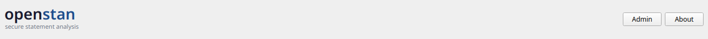
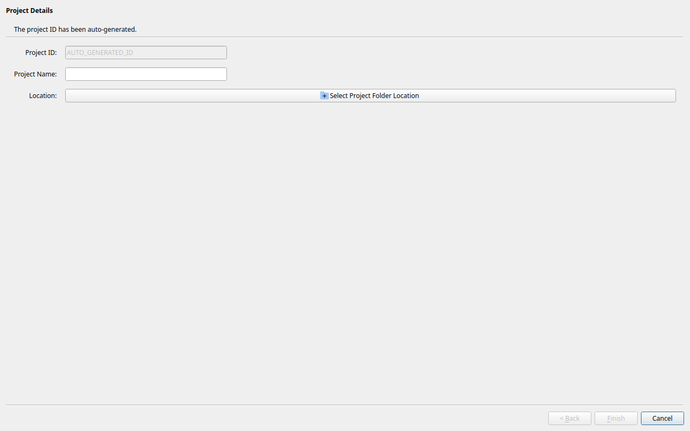
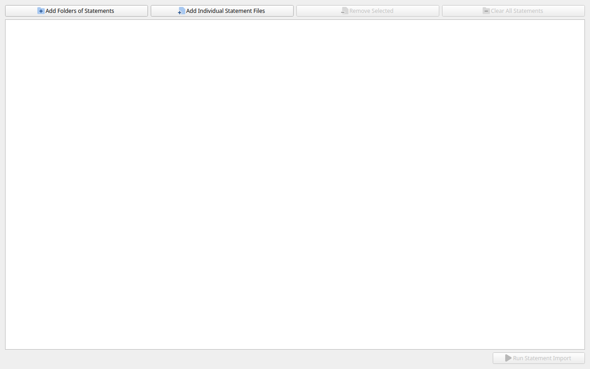
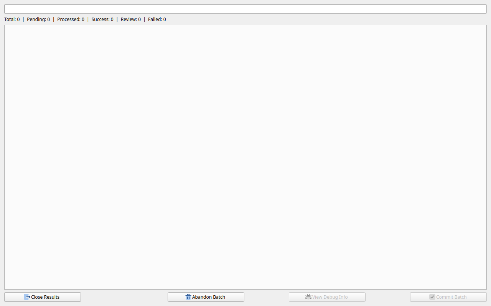

# Quick Start

This guide walks you through the full workflow from a fresh installation to your first committed batch of statements.

---

## Step 1 — Launch openstan

Open openstan from your application menu or desktop shortcut. On first run you will see an empty project selector and the application header.

---

## Step 2 — Create a project

A **project** is a folder on disk that holds your statement PDFs, configuration files, and the parsed transaction database. Each project is self-contained and portable.

1. Click **Create New Project** in the project selector bar.
2. Enter a **Project Name** (e.g. `Personal Finances`).
3. Click **Choose Folder** and select the parent directory where you want the project folder to be created. openstan will create a subfolder with the project name inside the directory you choose.
4. Click **Finish**.

The new project appears in the **Select an existing project** drop-down and becomes the active project.

!!! tip "Adding an existing project"
    If you have already created a project on another machine or moved a project folder, use **Add Existing Project** instead. Navigate to the existing project folder and openstan will register it in the UI without changing any files.

---

## Step 3 — Add statements to the import queue

1. Click **Import Statements** in the navigation bar (or press `Alt+I`).
2. Use **Add Folders of Statements** to add a whole directory of PDFs at once, or **Add Individual Statement Files** to pick specific files. Files are shown in a tree grouped by folder.
3. Review the queue. Use **Remove Selected** or **Clear All Statements** to adjust the list.

---

## Step 4 — Run the import

Click **Run Statement Import**. openstan sends each PDF to the parser in the background. A progress bar shows the overall status.

When processing is complete, the results panel opens automatically.

---

## Step 5 — Review results

The results panel shows three tabs:

| Tab | Meaning |
|---|---|
| **SUCCESS** | Statements parsed cleanly — these can be committed. |
| **REVIEW** | Statements parsed but the checks-and-balances totals do not match. |
| **FAILURE** | Statements that could not be parsed at all. |

For REVIEW and FAILURE rows, click **View Debug Info** to open a dialog with per-file debug output and the original PDF side by side.

!!! info "Unsupported banks"
    If all your statements appear in the FAILURE tab, your bank may not yet have a parser configuration. See the [bank\_statement\_parser guide on adding a new bank](https://boscorat.github.io/bank_statement_parser/guides/new-bank-config/) for instructions on creating a TOML config file.

---

## Step 6 — Commit the batch

When you are satisfied with the results, click **Commit Batch**. Only SUCCESS-status statements are written to the project database. REVIEW and FAILURE statements remain unimported.

Once committed, the queue unlocks and the **Project Info**, **Export Data**, and **Run Reports** navigation items become visible.

---

## Step 7 — Explore your data

- **Project Info** (`Alt+P`) — summary statistics, per-account breakdowns, and any coverage gaps detected between consecutive statements.
- **Export Data** (`Alt+E`) — export transactions to Excel, CSV, or JSON.
- **Run Reports** (`Alt+R`) — build custom reports with filters, grouping, and aggregations, and export or preview them live.

---

## Next steps

- Read the [Import Statements](screens/import-statements.md) screen guide for full details on the queue and import options.
- Read the [Export Data](screens/export-data.md) and [Advanced Export](screens/advanced-export.md) guides to learn about export specs.
- Read the [Run Reports](screens/run-reports.md) guide to get the most out of the report builder.
