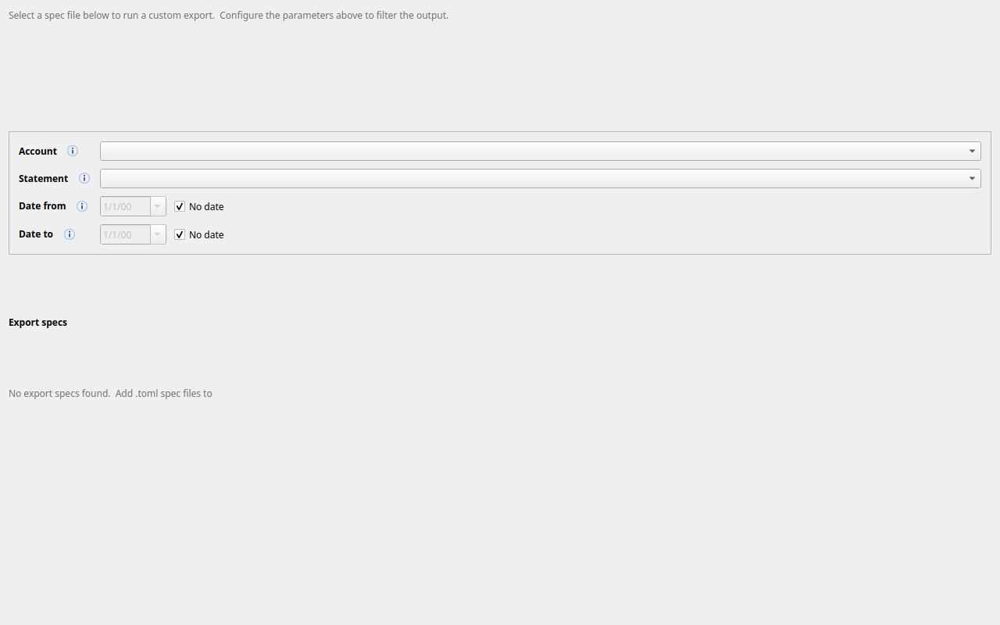

# Advanced Export

The **Advanced Export** tab lives inside the [Export Data](export-data.md) panel (`Alt+E`). It provides spec-driven custom exports where you control the account, statement, and date range, and the output format is defined by a TOML export spec file.

---

## Parameters

### Account

A drop-down listing all accounts in the project. The first option, **\<all accounts\>**, runs the export across every account.

### Statement

A drop-down that updates automatically when you change the **Account** selection. Lists all statements for the selected account, plus **(all statements)** as the first option.

### Date from / Date to

Date range filters. By default, both are disabled (the **No date** checkbox is ticked), meaning no date filtering is applied.

- Untick **No date** to enable the date picker and set a specific start or end date.
- You can set one or both limits independently.

---

## Export specs

The lower section of the panel lists the available export specs for the active project.

Each spec is a `.toml` file located in the project's `config/export/` directory. For each spec found, a button is shown displaying:

- The spec's **description** (from inside the TOML file).
- The spec's **filename** in smaller text below.

Click a button to run that spec with the current parameter selections. A progress bar and status label show the export progress.

If the `config/export/` directory contains no `.toml` files, the panel shows:

> *No export specs found*

---

## Creating and modifying export spec TOML files

Export specs are TOML configuration files that define the shape and content of a custom export. For a full guide to creating and editing these files, see the [bank\_statement\_parser guide on adding a new bank](https://boscorat.github.io/bank_statement_parser/guides/new-bank-config/).

!!! tip "Where to put spec files"
    Place your `.toml` export spec files in `<project-folder>/config/export/`. openstan rescans this directory each time you open the Export Data panel.
