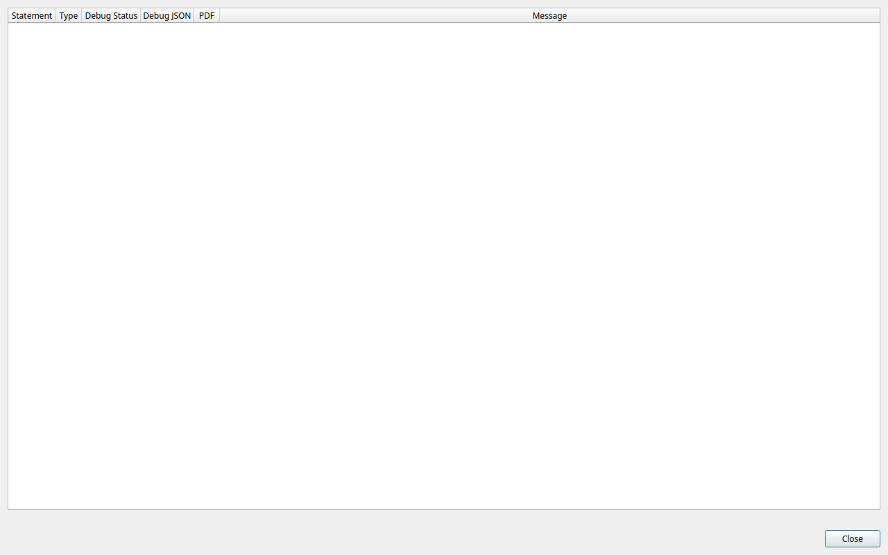

# Import Results

The **Import Results** panel appears automatically when a batch finishes processing. It summarises what happened and lets you decide what to do next.

---

## Summary bar

A single line at the top of the panel shows counts for the current batch:

| Counter | Meaning |
|---|---|
| **Total** | Total number of PDF files submitted. |
| **Pending** | Files not yet processed (only visible during a running import). |
| **Processed** | Files for which processing has completed (success or failure). |
| **Success** | Files parsed cleanly with matching checks and balances. |
| **Review** | Files parsed but with checks-and-balances discrepancies. |
| **Failed** | Files that could not be parsed. |

---

## Result tabs

Results are split across three tabs. Each tab is hidden if it has no rows.

### SUCCESS tab

Lists all statements that were parsed cleanly. Columns typically include the filename, detected bank, account details, statement date range, and transaction count.

Statements in this tab will be written to the project database when you click **Commit Batch**.

### REVIEW tab

Lists statements where parsing succeeded but the extracted opening/closing balances do not reconcile with the sum of transactions. This often indicates a parsing issue with a specific statement format variant.

These statements are **not** committed even if you click **Commit Batch**. Investigate them using **View Debug Info** before deciding whether to proceed.

### FAILURE tab

Lists statements that could not be parsed at all. Common causes:

- The bank is not supported (no TOML configuration exists).
- The PDF is password-protected, corrupted, or not a real bank statement.
- A new statement format has been introduced by the bank that differs from the configured layout.

---

## Debug Info dialog

Click **View Debug Info** to open a dialog showing per-file debug output for all REVIEW and FAILURE statements.

| Column | Description |
|---|---|
| **Statement** | The PDF filename. |
| **Type** | `REVIEW` or `FAILURE`. |
| **Debug Status** | Processing state: `pending` → `running` → `done` / `error` / `unavailable`. |
| **Open JSON** | Opens the debug JSON output file in your system's default JSON viewer (enabled once the file is generated). |
| **Open PDF** | Opens the original PDF in your system's default PDF viewer. |
| **Message** | The error or review message from the parser. |

A progress indicator at the bottom of the dialog shows how many debug files have been generated.

---

## Action buttons

| Button | Action |
|---|---|
| **Close Results** | Returns to the [Import Statements](import-statements.md) queue panel. The batch remains open — you can return to results at any time via **View Statement Results**. |
| **Abandon Batch** | Discards all results for this batch and unlocks the import queue. This cannot be undone. |
| **View Debug Info** | Opens the Debug Info dialog (enabled when REVIEW or FAILURE rows exist). |
| **Commit Batch** | Writes all SUCCESS-status statements to the project database and closes the batch. Enabled only when at least one SUCCESS row exists. |

!!! warning "REVIEW statements are not committed"
    Clicking **Commit Batch** commits only SUCCESS statements. REVIEW statements remain unimported. If you want to investigate and re-import a REVIEW statement, use **Abandon Batch**, fix the issue, and re-run the import.

!!! info "After committing"
    Once a batch is committed, the **Project Info**, **Export Data**, and **Run Reports** navigation items become visible (or are updated if they were already visible).
