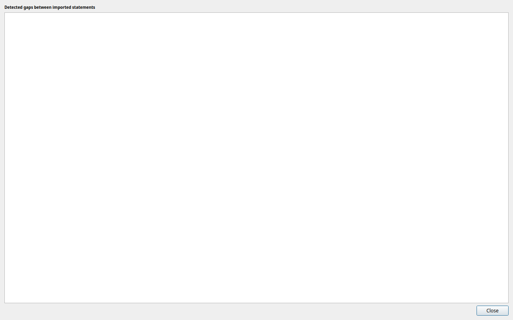

# Project Info

The **Project Info** panel (`Alt+P`) provides a summary of all committed data in the active project.

---

## Placeholder state

If no statements have been committed yet, the panel shows a placeholder message:

> *No data yet — import and commit some statements to see your project summary.*

Import and commit at least one batch to populate this panel. See the [Quick Start guide](../quickstart.md) for a walkthrough.

---

## Summary strip

Once data is available, a headline summary is shown at the top:

| Item | Description |
|---|---|
| **Transactions** | Total number of individual transactions across all statements. |
| **Statements** | Total number of committed statement documents. |
| **Accounts** | Number of distinct accounts represented. |
| **Date range** | The earliest and latest dates covered by any committed statement (e.g. `2023-01-01 — 2024-12-31`). |

---

## Accounts table

Below the summary, a table shows a per-account breakdown:

| Column | Description |
|---|---|
| **Account holder** | The name of the account holder as it appears on the statement. |
| **Account type** | The type of account (e.g. Current, Savings). |
| **Account number** | The account number. |
| **Statements** | Number of committed statements for this account. |
| **Transactions** | Number of transactions for this account. |
| **From** | Earliest statement date for this account. |
| **To** | Latest statement date for this account. |

---

## Statement coverage gaps

If openstan detects a gap in statement coverage for any account — meaning there is a period of time not covered by any committed statement — a warning button appears below the accounts table:

> **N gap(s) detected — click for details**

Click the button to open the **Gap Detail** dialog.

### Gap Detail dialog

The dialog shows a tree grouped by account. Each account node lists the gaps detected:

> *Missing statement between 2023-06-30 and 2023-08-01*

A gap is reported whenever the end date of one statement and the start date of the next statement for the same account are not contiguous. This may indicate a missing statement file.

!!! tip "Gaps are informational"
    Gaps do not prevent exporting or reporting. They are shown as a convenience to help you identify any statements you may have forgotten to import.
