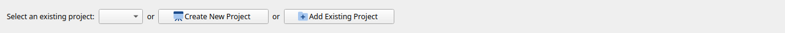
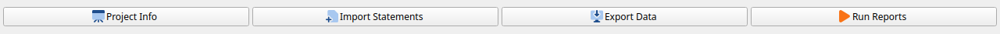

# Project Management

The project management controls are always visible at the top of the application window, below the title bar.

---

## Project selector bar

The project selector bar contains three controls:

| Control | Purpose |
|---|---|
| **Select an existing project** drop-down | Switch between projects you have previously registered. |
| **Create New Project** | Open the project creation wizard to scaffold a brand-new project folder. |
| **Add Existing Project** | Register an existing project folder (created on another machine, or after moving files). |

Switching projects in the drop-down immediately updates all panels to reflect the selected project's data.

---

## Creating a new project

Click **Create New Project** to open the project wizard.

| Field | Description |
|---|---|
| **Project ID** | A unique identifier generated automatically. Read-only. |
| **Project Name** | A human-readable name for the project (e.g. `Personal Finances 2024`). |
| **Project Location** | The **parent** directory in which the project sub-folder will be created. Click **Choose Folder** to browse. The sub-folder is named after the project name. |

Click **Finish** to create the project. openstan calls the `bank_statement_parser` library to scaffold the project folder structure, then registers the new project in the application database and selects it automatically.

!!! info "What gets created on disk"
    The project folder contains a `config/` directory (with import and export TOML configuration files), a `statements/` directory, and a `project.db` SQLite database managed by `bank_statement_parser`. See the [bank\_statement\_parser project structure guide](https://boscorat.github.io/bank_statement_parser/guides/project-structure/) for full details.

---

## Adding an existing project

Click **Add Existing Project** to open the wizard in "existing" mode.

| Field | Description |
|---|---|
| **Project ID** | Generated automatically (a new ID is assigned in the openstan UI database). |
| **Project Name** | Pre-populated from the folder name; you can edit it. |
| **Project Location** | Navigate to the **existing** project folder itself (not its parent). |

Click **Finish** to register the project. No files are modified on disk.

---

## Navigation bar

Once a project is selected, the navigation bar appears below the project selector:

| Button | Shortcut | Panel |
|---|---|---|
| **Project Info** | `Alt+P` | Summary statistics and account breakdown |
| **Import Statements** | `Alt+I` | Statement queue and import runner |
| **Export Data** | `Alt+E` | Standard and advanced data exports |
| **Run Reports** | `Alt+R` | No-code report builder |

**Project Info**, **Export Data**, and **Run Reports** are hidden until at least one batch has been committed to the project database.

---

## Footer

The footer bar at the bottom of the window shows contextual session information:

- **Left**: Current OS username and session UUID.
- **Centre**: Active project name and ID.
- **Right**: Application copyright notice.

Double-clicking anywhere on the footer opens the [Admin dialog](admin.md).
