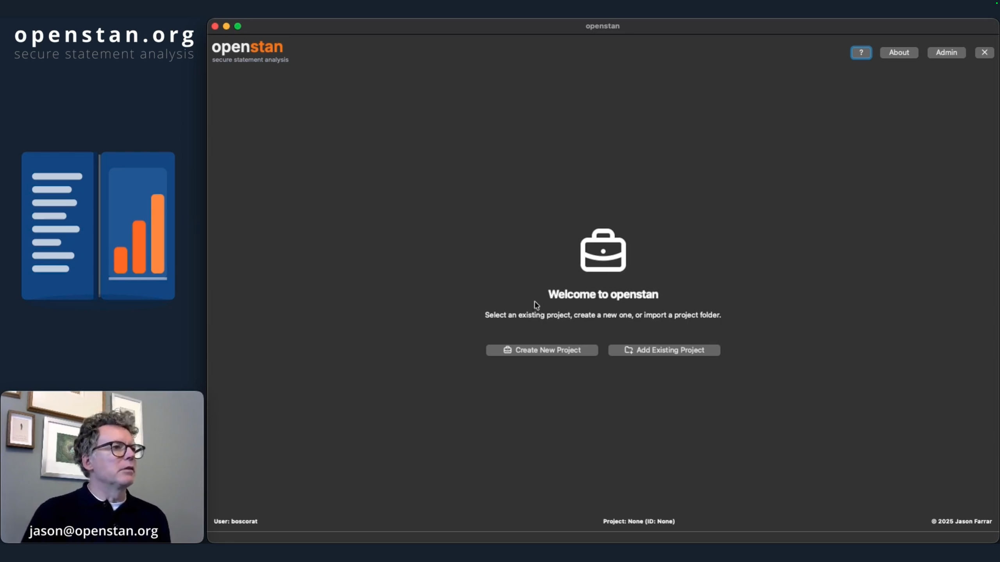
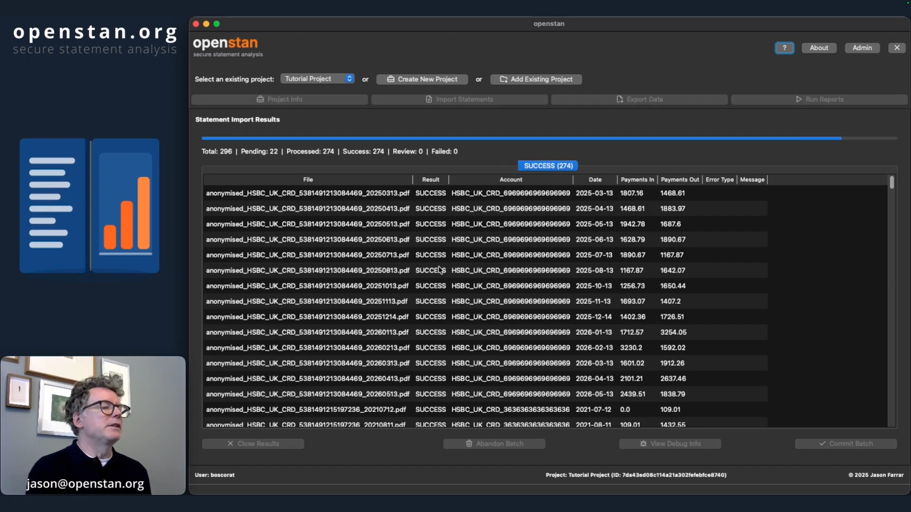

# Video Tutorials

## Quick Start (2 min)

A fast overview of the core workflow: create a project, import PDFs, review and commit.

[Watch on YouTube](https://youtu.be/6llok5CWK4s){ .md-button .md-button--primary }

---

## Full Walkthrough (12 min)

The complete tutorial covering reports, advanced export, and tips for getting the most out of openstan.

[Watch on YouTube](https://youtu.be/fRcoZB54FKQ){ .md-button .md-button--primary }
