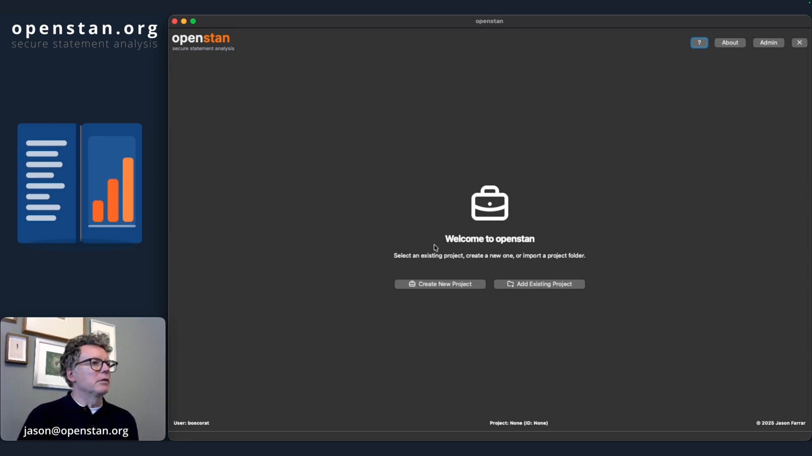
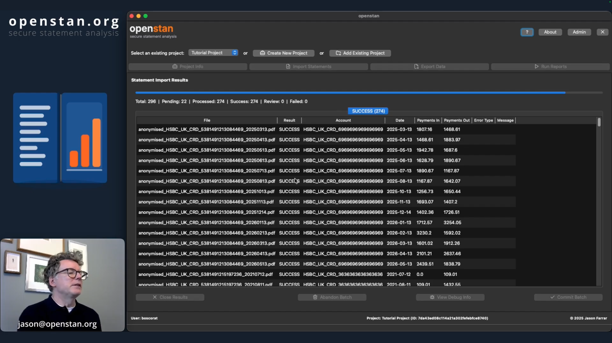

# Video Tutorials

Short videos covering the core openstan workflow — creating a project, importing bank statement PDFs, reviewing results, and exporting to Excel. New tutorials are published on the [openstan YouTube channel](https://youtube.com/@openstan).

---

## Quick Start (2 min)

A fast overview of the core workflow: create a project, import PDFs, review and commit.

[Watch on YouTube](https://youtu.be/6llok5CWK4s){ .md-button .md-button--primary }

---

## Full Walkthrough (12 min)

The complete tutorial covering reports, advanced export, and tips for getting the most out of openstan.

[Watch on YouTube](https://youtu.be/fRcoZB54FKQ){ .md-button .md-button--primary }

---

## See Also

- **[Quick Start Guide](quickstart.md)** – Step-by-step written guide to get you started
- **[Installation](installation.md)** – Download and install openstan
- **[Use Cases](use-cases/index.md)** – Explore how openstan works for different scenarios
- **[Feature Guides](guides/project-management.md)** – Detailed walkthroughs of every screen and tool
- **[Logging & Debugging Guide](guides/logging.md)** – Diagnose import and export issues
